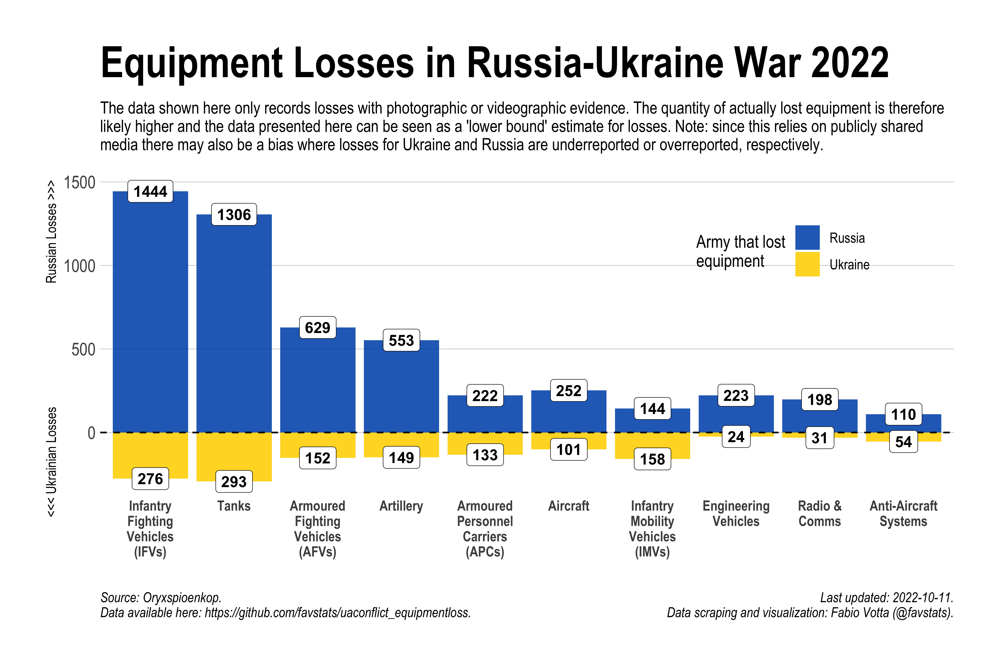
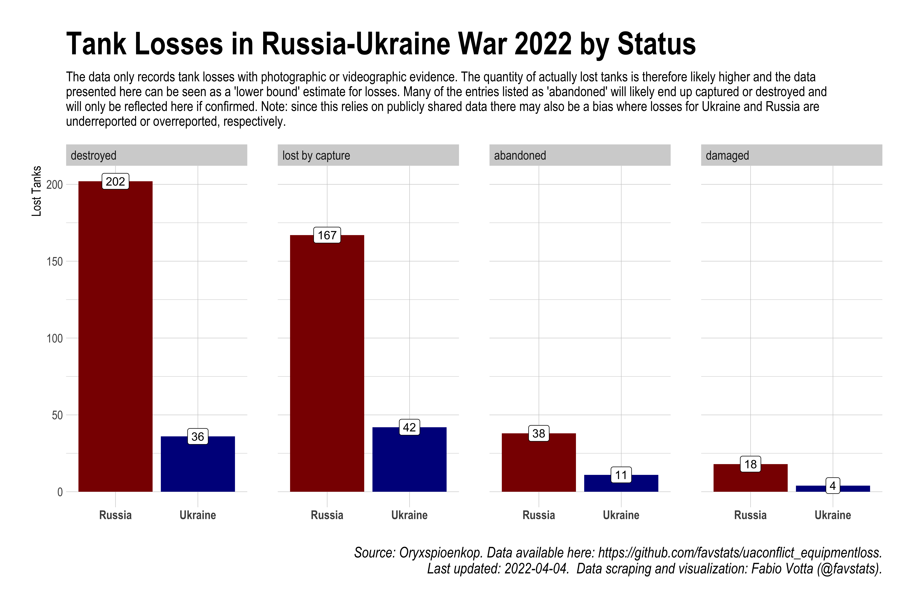
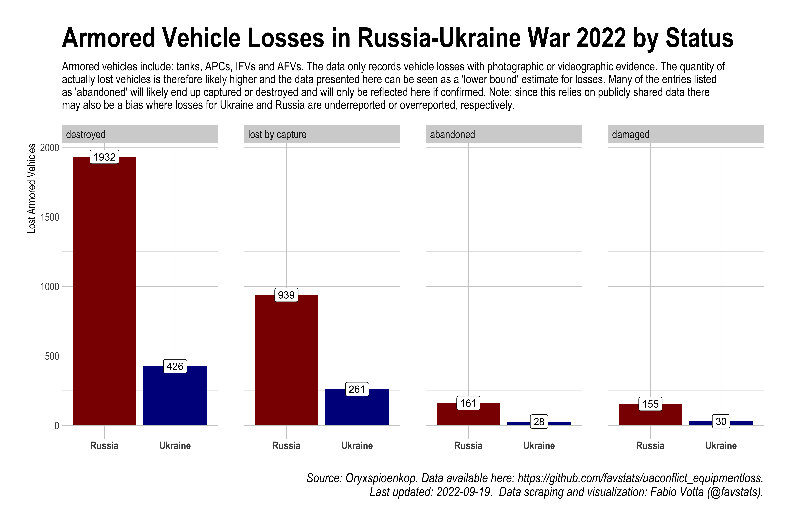
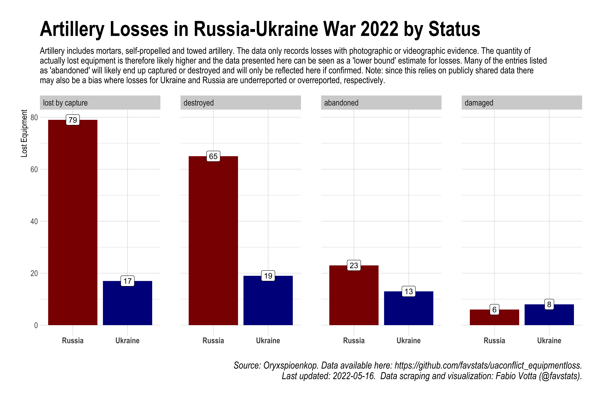
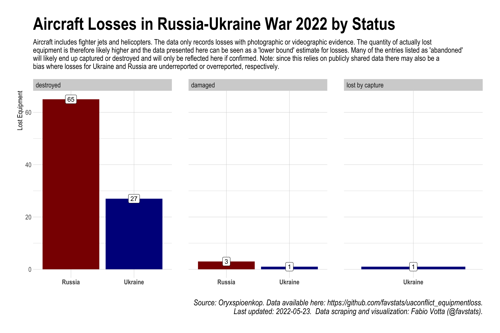
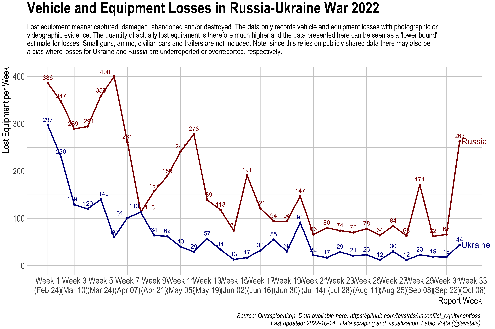
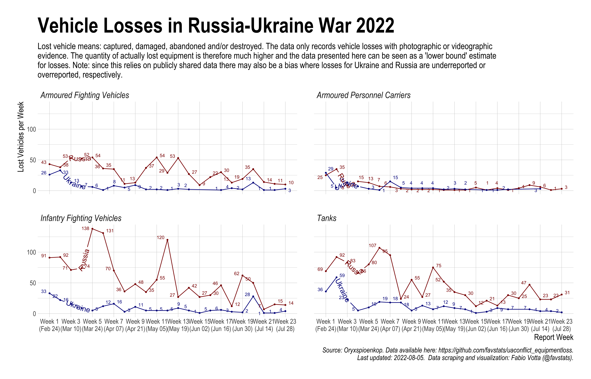
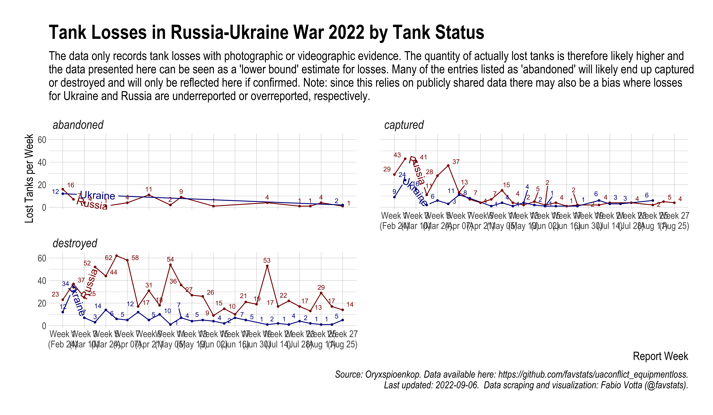

<!-- README.md is generated from README.Rmd. Please edit that file -->

```{r, include = FALSE}
knitr::opts_chunk$set(
  collapse = TRUE,
  comment = "#>"
)

library(tidyverse)
```

# Equipment losses in Russia-Ukraine War 2022

This repo scrapes [this list](https://www.oryxspioenkop.com/2022/02/attack-on-europe-documenting-equipment.html) by Oryxspioenkop (daily) to document and visualize equipment losses in the Russia-Ukraine war.

Oryxspioenkop says about this dataset:

> This list only includes destroyed vehicles and equipment of which photo or videographic evidence is available. Therefore, the amount of equipment destroyed is significantly higher than recorded here. Small arms, munitions, civilian vehicles, trailers and derelict equipment (including aircraft) are not included in this list. All possible effort has gone into discerning the status of equipment between captured or abandoned. Many of the entries listed as 'abandoned' will likely end up captured or destroyed. Similarly, some of the captured equipment might be destroyed if it can't be recovered. ATGMs and MANPADS are included in the list but not included in the ultimate count. The Soviet flag is used when the equipment in question was produced prior to 1991.

Note: since this relies on publicly shared data there may also be a bias where losses for Ukraine and Russia are underreported or overreported, respectively. While it may be true that Russia is losing much more equipment than Ukraine, it might be faulty to assume so based on this data alone.

## Main dataset

The main dataset is `data/oryx_data.rds` but there are also daily `.csv` to be found in the `data/daily` subfolder. Simply retrieve the data from the latest available day or from any other timestamp that you would like to analyze.

```{r}
read_csv("data/daily/2022-03-26_oryx_data.csv")
```

## OCR for timestamping images associated with losses

Each entry on the equipment loss list has an image or source associated to confirm the loss. In almost all cases the image includes a date which likely represent the date on which the media file was first seen by the Oryx team. In order to make use of this timestamp I employ `Google Cloud Vision API` to extract dates from images of the Oryx dateset.

The cleaned dataset (with some manual coding) can be found here: `data/dates_dat.csv` andd can be merged into the main dataset via the image link. If you prefer the merged dataset then you can use `date/oryx_data_dates.csv`.

This dataset will only be updated every now and then as it requires some manual checking. Maybe I try to automate it further in the future :)


## Visualizations

### Overall losses by type I 



### Overall losses by type II


### Tank losses by status



### Armor losses by status



### Artillery losses by status



### Aircraft losses by status



### Overall losses over time



### Overall losses over time by (some) vehicle types



### Overall tank losses over time



